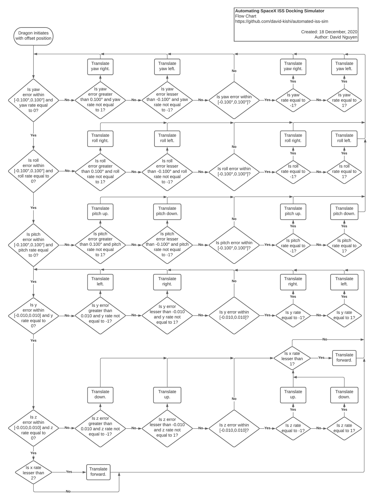

# Automated SpaceX ISS Docking Simulator

Automating SpaceX's ISS Docking Simulator using JavaScript and control feedback theory.

**Try it yourself [here](http://www.knytes.com/automated-iss-sim/)!** *(If hyperlink does not work: http://www.knytes.com/automated-iss-sim/)*

- [Automated SpaceX ISS Docking Simulator](#automated-spacex-iss-docking-simulator)
  - [How it works](#how-it-works)
  - [Known Bugs](#known-bugs)
  - [Future Updates](#future-updates)
  - [Credit](#credit)

## How it works

**Assumptions for v1.00.a-beta:**

- All Dragon thrusters are fully functional
- Dragon starts with all axes stationary
- Thrusters produce a constant amount of thrust

**TLDR;**

1. Press `Auto` Button on Main Menu
2. 10 second counter starts while Dragon initiates starting parameters
3. If yaw is not zeroed, run checks and correction burns.
4. Else if roll is not zeroed, run checks and correction burns.
5. Else if pitch is not zeroed, run checks and correction burns.
6. Repeat 3-5 in order till Pitch, Yaw, and Roll are all zeroed.
7. If y-axis is not zeroed, run checks and correction burns.
8. Else if z-axis is not zeroed, run checks and correction burns.
   1. If x-rate is less than 1, translate forward.
9. Else if x-rate is less than 2, translate forward.
10. Repeat 7-9 till Dragon docks with ISS.

## Known Bugs

- Depending on browser and computer specs, behavior of the automated demo may be different. This is, at the moment, uncontrollable as I try to figure out the reason.
  - For reference, all of my testing is done with the following PC spec:
    - Windows 10
    - Google Chrome Version 87.0.4280.88 (Official Build) (64-bit)
      - Hardware Acceleration On
    - i5-7600k @ 4.7 GHz
    - 2x8 GB DDR4 @ 3000 MHz
    - NVIDIA GTX 1070 8GB
- Translating Pitch, Yaw, and/or Roll after it has already been corrected will not be autocorrected by the program since it has already moved onto the XYZ-correction phase.

## Future Updates

- Optimization of z axis correction *(currently inefficient because gravity consistently pulls it down)*
- Auto Mode On/Off Switch
- Telemetry Visual Graphs
- Randomize starting points *(original code has the initial offsets as a constant)*

## Credit

SpaceX ISS Docking Simulator: https://iss-sim.spacex.com/
